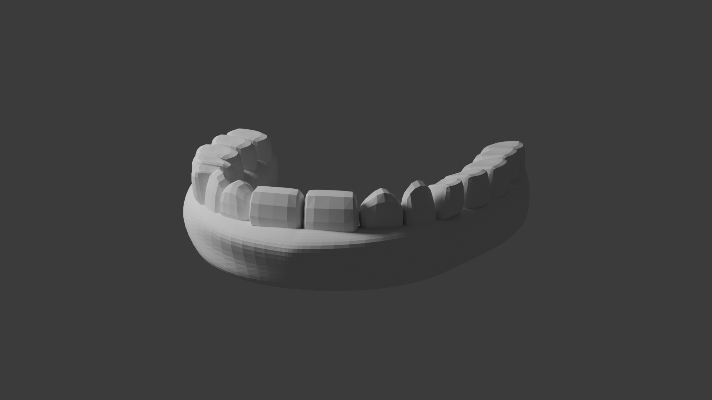
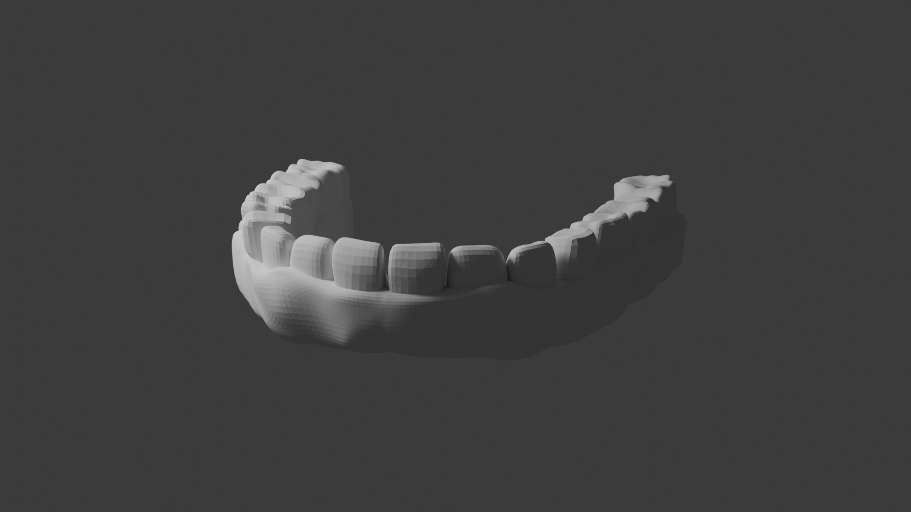
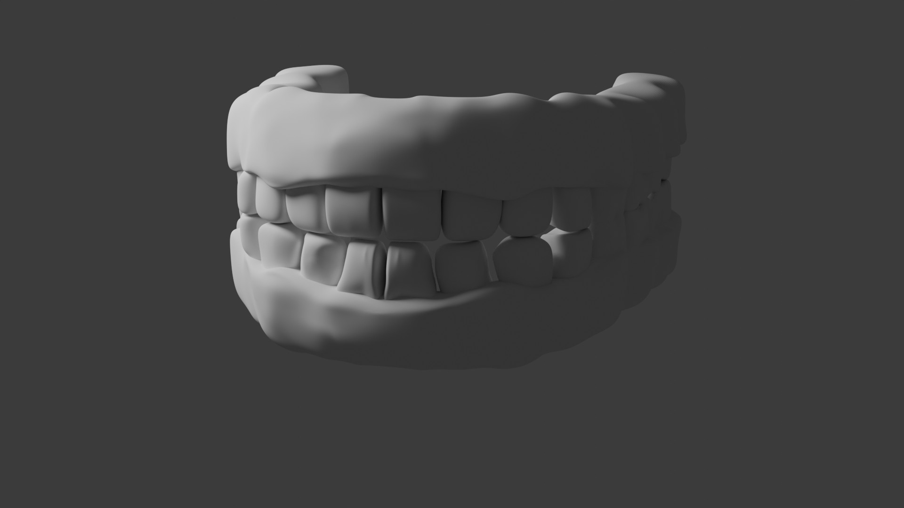
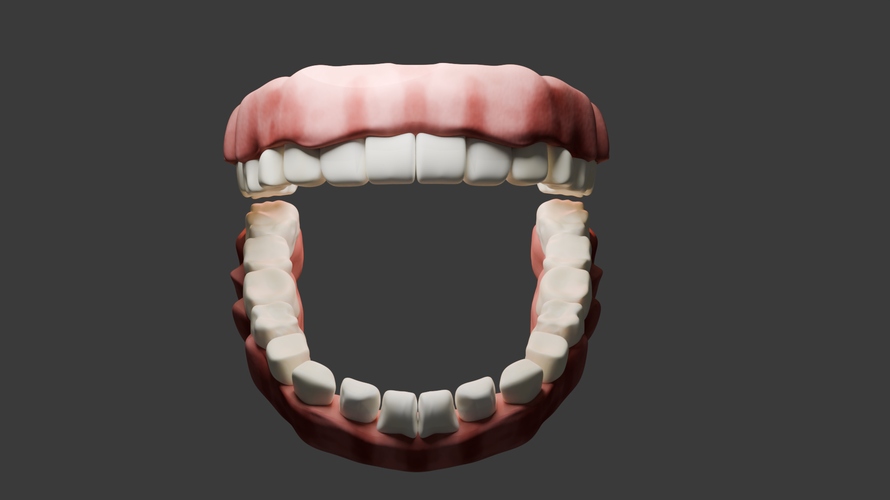

# PixelicaCG - 01 - How To Sculpt Teeth and Gums in Blender (Full Guide)

[.jpg)](https://youtu.be/j5O_FSjfV2w)

00:00 - Intro  
00:11 - Modeling the Base shape for Gums  
01:31 - Modeling the Teeth Base  
03:50 - Make the Base ready for sculpting  
04:40 - How to Sculpt the Teeth  
07:28 - How to Sculpt the Details of the Teeth  
11:34 - Fixing the topology of the Gums  
12:00 - How to Sculpt the Gums  
13:16 - How to Add details to the Gums  
14:40 - Adding more details to the teeth  
16:23 - UV Unwrapping the Teeth and Gums  
17:17 - Making the bottom teeth  
18:24 - Final Results  
18:35 - Outro  

# PixelicaCG - 02 - How To Create Realistic Teeth And Gums Shader in Blender

00:00 - Intro  
00:22 - Setting up the Gums Base Color  
01:48 - Painting the Gums texture  
03:16 - Setting up the Gums Shader  
03:26 - Painting the Teeth Texture  
05:35 - Improving the Teeth and Gums Texture  
07:05 - Setting up the Teeth  
07:17 - Adding Bumps to the Shader  
08:15 - Making the Teeth Darker  
08:47 - Improving the Gums Shader  
09:42 - Results  
09:47 - Outro  

# Results

